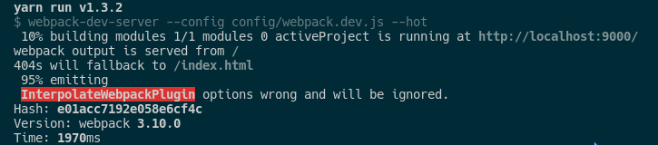
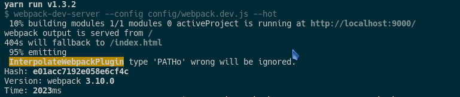

# interpolate-webpack-plugin

> Support webpack@^4, you should use html-webpack-plugin@next(now is html-webpack-plugin@^4.0.8).


[](https://circleci.com/gh/TaylorPzreal/interpolate-webpack-plugin)

[Extend react-dev-utils/InterpolateHtmlPlugin](https://github.com/facebookincubator/create-react-app/blob/master/packages/react-dev-utils/InterpolateHtmlPlugin.js)

It works in tandem with [HtmlWebpackPlugin@next](https://github.com/ampedandwired/html-webpack-plugin#events).

I use it for dynamic inject library that DllPlugin generated and in React product replace '%PUBLIC_URL%'.

## Usage

### 1. Installation

```bash
yarn add -D interpolate-webpack-plugin
```

### 2. index.html

```html
<!-- Write any variables use %VARIABLE% -->

<!-- For example -->
<script src="%INJECT_DLL%"></script>
```

### 3. Config webpack.config.js

```js
const InterpolateWebpackPlugin = require('interpolate-webpack-plugin');

plugins: [
  // options could be an object or array.
  new InterpolateWebpackPlugin([{
    key: 'INJECT_DLL',
    value: 'ABSOLUTELY',
    type: 'STRING'
    // type can only be 'STRING' or 'PATH', default is 'STRING'.
    // When type is 'PATH', the 'value' you could input a glob string,like:
    // process.cwd() + 'dll/*.js',
    // but it could only resolve matched first file name.
  }])
]
```

If you input wrong options or wrong type, will got a tip:

#### Options wrong



#### Type wrong



## License

MIT License Copyright (c) 2017 TaylorPzreal
